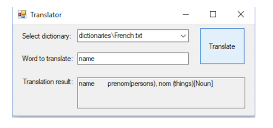

# simple-dictionary

Implementing some very basic translator
---

For this purpose, we use freely available dictionary files in txt format. 

If application is launched, select dictionary file from drop-down list, enter word and press
"Translate", so we get translation in result window but if word is not found, then program will
return to first match what contain this word in substring and if this is also not found, so then
program will print "Not found" in result window.

